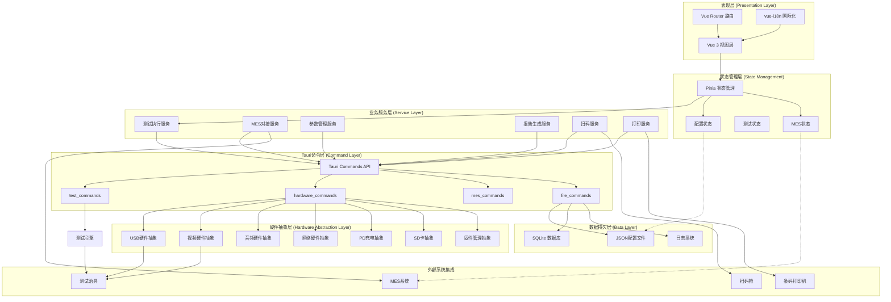
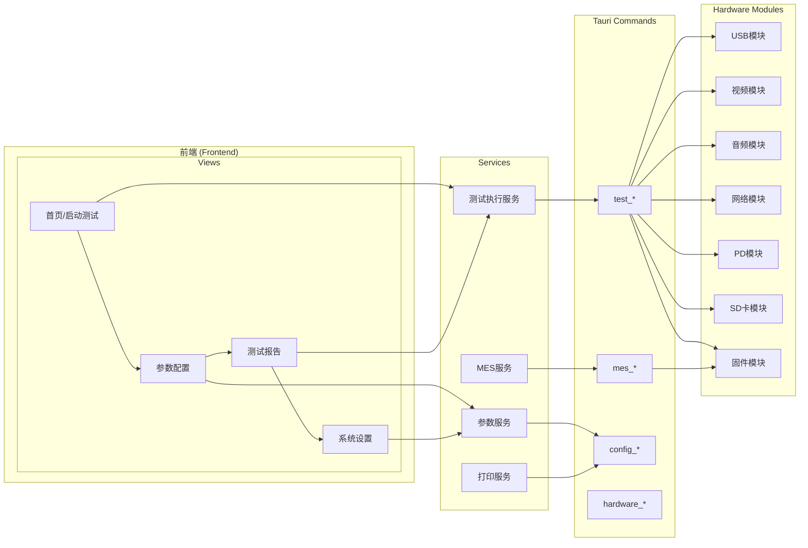
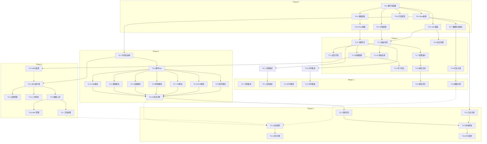

# TYPE-C扩展坞产测软件系统架构设计

## 文档信息

| 项目 | 内容 |
|-----|------|
| 项目名称 | TYPE-C扩展坞产测软件 |
| 文档版本 | v1.0 |
| 创建日期 | 2024-03-20 |
| 作者 | 系统架构师 |
| 状态 | 已完成 |

---

## 1. 整体架构设计

### 1.1 系统分层架构图



### 1.2 模块职责说明

| 模块名称 | 层级归属 | 核心职责 | 关键接口 |
|---------|---------|---------|---------|
| **视图层 (Views)** | 表现层 | 页面渲染、用户交互、表单处理 | Vue组件、Element Plus |
| **路由管理 (Router)** | 表现层 | 页面导航、权限控制 | vue-router |
| **国际化 (i18n)** | 表现层 | 中越双语切换、动态翻译 | vue-i18n |
| **配置状态 (Config Store)** | 状态层 | 功能开关配置、系统参数 | Pinia store |
| **测试状态 (Test Store)** | 状态层 | 测试进度、结果数据、实时状态 | Pinia store |
| **MES状态 (MES Store)** | 状态层 | MES连接状态、订单数据 | Pinia store |
| **测试执行服务** | 服务层 | 测试流程编排、执行控制 | `testService.execute()` |
| **参数管理服务** | 服务层 | 配置导入/导出、参数校验 | `paramService.load()` |
| **MES对接服务** | 服务层 | MES API调用、数据同步 | `mesService.sync()` |
| **报告生成服务** | 服务层 | 测试报告生成、导出 | `reportService.generate()` |
| **Tauri Commands** | 命令层 | 前后端通信桥接 | Rust IPC |
| **测试引擎** | 硬件层 | 测试逻辑执行、断言判断 | Rust模块 |
| **硬件抽象层** | 硬件层 | 硬件协议通信、驱动交互 | Rust trait |
| **SQLite数据库** | 数据层 | 配置存储、日志记录、测试历史 | rusqlite |
| **JSON配置** | 数据层 | 测试参数文件读写 | serde_json |

### 1.3 模块依赖关系图



---

## 2. 技术选型说明

### 2.1 框架选型：Tauri 2.x vs Electron

| 评估维度 | Tauri 2.x | Electron | 评分说明 |
|---------|-----------|----------|---------|
| **安装包大小** | 3-10 MB | 120-200 MB | Tauri完胜，低配置电脑下载更快 |
| **内存占用** | 20-50 MB | 150-500 MB | Tauri对低配置电脑更友好 |
| **启动速度** | < 500ms | 2-5s | Tauri原生体验 |
| **本地权限** | Rust原生，无限制 | Node.js沙箱受限 | Tauri更适合硬件通信 |
| **系统集成** | 系统原生界面 | WebView渲染 | Tauri窗口更原生 |
| **安全漏洞** | 攻击面小 | 历史高危漏洞多 | Tauri更安全 |
| **开发体验** | Rust学习曲线陡 | 前端友好 | Electron略优 |
| **生态插件** | 快速成长 | 成熟完善 | Electron生态更丰富 |
| **MES/硬件集成** | 原生串口/HID/USB | 需native模块 | 两者均可，Tauri更直接 |

**结论**：选择Tauri 2.x，基于以下关键因素：

1. **性能优先**：低配置Windows 10/11电脑需要快速启动、低内存占用
2. **硬件通信需求**：Rust可直接调用Windows API（USB HID、串口、libusb）
3. **安全要求**：MES系统对接需要高安全级别
4. **安装包大小**：便于工厂环境批量部署

### 2.2 前端技术栈选择

| 技术 | 选择 | 理由 |
|-----|------|------|
| **Vue 3** | ✅ 采用 | Composition API灵活性高，与Tauri Vue模板成熟 |
| **Element Plus** | ✅ 采用 | 企业级组件库，中越双语文档完善，表格/表单能力强 |
| **Pinia** | ✅ 采用 | Vue 3官方推荐，TypeScript支持好，比Vuex更轻量 |
| **vue-i18n** | ✅ 采用 | Vue生态最成熟的国际化方案，支持lazy load |
| **Vite** | ✅ 采用 | Tauri默认构建工具，开发体验好 |

### 2.3 数据库选型

| 数据库 | 适用场景 | 选型理由 |
|-------|---------|---------|
| **SQLite** | ✅ 本地结构化数据 | 零配置、单文件、无服务器、事务完整 |
| **Redis** | ❌ 不适用 | 工厂内网环境无需分布式缓存 |
| **PostgreSQL** | ❌ 不适用 | MES数据走API，本地无需关系型数据库服务 |
| **IndexedDB** | ❌ 不采用 | Tauri环境下SQLite性能更优 |

**SQLite应用场景**：
- 测试配置参数存储
- 测试历史记录查询
- MES同步日志
- 系统运行日志
- 用户操作审计

---

## 3. 项目目录结构

```
dock-tester/                           # 项目根目录
├── src/                               # 前端源码
│   ├── assets/                       # 静态资源
│   │   ├── images/                  # 图片资源
│   │   │   ├── logo.png
│   │   │   └── icons/
│   │   └── styles/                  # 全局样式
│   │       ├── variables.css        # CSS变量定义
│   │       ├── global.css           # 全局样式
│   │       └── theme/                # 主题配置
│   ├── components/                   # 公共组件
│   │   ├── common/                   # 通用组件
│   │   │   ├── AppHeader.vue         # 顶部导航
│   │   │   ├── AppSidebar.vue        # 侧边栏
│   │   │   ├── PageContainer.vue     # 页面容器
│   │   │   └── StatusBadge.vue       # 状态徽章
│   │   ├── test/                     # 测试组件
│   │   │   ├── TestCard.vue          # 测试卡片
│   │   │   ├── TestProgress.vue      # 测试进度条
│   │   │   ├── TestResult.vue        # 测试结果展示
│   │   │   ├── TestChart.vue         # 测试图表
│   │   │   └── TestLogViewer.vue     # 测试日志
│   │   ├── config/                   # 配置组件
│   │   │   ├── ParamEditor.vue       # 参数编辑器
│   │   │   ├── ConfigImport.vue      # 配置导入
│   │   │   └── ConfigExport.vue      # 配置导出
│   │   └── mes/                      # MES组件
│   │       ├── MesStatus.vue         # MES状态指示
│   │       ├── OrderList.vue         # 工单列表
│   │       └── ScanInput.vue         # 扫码输入
│   ├── views/                        # 页面视图
│   │   ├── HomeView.vue              # 首页/启动测试
│   │   ├── TestView.vue              # 测试执行页
│   │   ├── ConfigView.vue            # 参数配置页
│   │   ├── ReportView.vue            # 测试报告页
│   │   ├── HistoryView.vue           # 历史记录页
│   │   ├── SettingsView.vue          # 系统设置页
│   │   └── LoginView.vue             # 登录页
│   ├── stores/                       # Pinia状态管理
│   │   ├── index.ts                  # store入口
│   │   ├── testStore.ts              # 测试状态
│   │   ├── configStore.ts           # 配置状态
│   │   ├── mesStore.ts              # MES状态
│   │   ├── userStore.ts             # 用户状态
│   │   └── systemStore.ts           # 系统状态
│   ├── services/                     # 业务服务层
│   │   ├── testService.ts            # 测试执行服务
│   │   ├── mesService.ts            # MES对接服务
│   │   ├── paramService.ts          # 参数管理服务
│   │   ├── reportService.ts         # 报告生成服务
│   │   ├── scanService.ts           # 扫码服务
│   │   ├── printService.ts          # 打印服务
│   │   └── i18nService.ts           # 国际化服务
│   ├── router/                       # 路由配置
│   │   ├── index.ts                  # 路由入口
│   │   └── routes.ts                 # 路由定义
│   ├── locales/                      # 国际化文件
│   │   ├── index.ts                  # i18n入口
│   │   ├── zh-CN.json               # 中文简体
│   │   ├── vi-VN.json               # 越南语
│   │   └── en-US.json               # 英文（预留）
│   ├── utils/                        # 工具函数
│   │   ├── http.ts                   # Tauri HTTP封装
│   │   ├── storage.ts                # 本地存储工具
│   │   ├── validators.ts            # 表单校验
│   │   ├── formatters.ts            # 数据格式化
│   │   ├── logger.ts                # 日志工具
│   │   └── constants.ts             # 常量定义
│   ├── types/                        # TypeScript类型定义
│   │   ├── test.ts                  # 测试相关类型
│   │   ├── config.ts                # 配置类型
│   │   ├── mes.ts                   # MES类型
│   │   └── api.ts                   # API类型
│   ├── App.vue                      # 根组件
│   └── main.ts                      # 应用入口
│
├── src-tauri/                       # Tauri后端源码
│   ├── src/
│   │   ├── main.rs                  # 入口函数
│   │   ├── lib.rs                   # 模块声明
│   │   ├── commands/                # Tauri命令模块
│   │   │   ├── mod.rs               # 模块声明
│   │   │   ├── test_commands.rs     # 测试命令
│   │   │   ├── hardware_commands.rs # 硬件命令
│   │   │   ├── mes_commands.rs     # MES命令
│   │   │   ├── config_commands.rs   # 配置命令
│   │   │   └── file_commands.rs     # 文件命令
│   │   ├── hardware/                # 硬件抽象层
│   │   │   ├── mod.rs               # 模块声明
│   │   │   ├── traits.rs            # 硬件trait定义
│   │   │   ├── usb.rs               # USB硬件通信
│   │   │   ├── video.rs             # 视频硬件通信
│   │   │   ├── audio.rs             # 音频硬件通信
│   │   │   ├── network.rs           # 网络硬件通信
│   │   │   ├── pd_charger.rs        # PD充电通信
│   │   │   ├── sd_card.rs           # SD卡通信
│   │   │   └── firmware.rs          # 固件管理
│   │   ├── test/                    # 测试引擎
│   │   │   ├── mod.rs               # 模块声明
│   │   │   ├── engine.rs            # 测试引擎核心
│   │   │   ├── runner.rs            # 测试运行器
│   │   │   ├── validator.rs         # 结果校验器
│   │   │   └── reporter.rs          # 报告生成器
│   │   ├── mes/                     # MES对接模块
│   │   │   ├── mod.rs               # 模块声明
│   │   │   ├── client.rs            # MES客户端
│   │   │   ├── api.rs               # API定义
│   │   │   └── sync.rs              # 数据同步
│   │   ├── database/                # 数据库模块
│   │   │   ├── mod.rs               # 模块声明
│   │   │   ├── schema.rs            # 数据库schema
│   │   │   ├── migrations/          # 数据库迁移
│   │   │   └── queries.rs           # 查询封装
│   │   ├── config/                  # 配置管理
│   │   │   ├── mod.rs               # 模块声明
│   │   │   ├── loader.rs            # 配置加载
│   │   │   └── validator.rs         # 配置校验
│   │   └── utils/                   # Rust工具
│   │       ├── mod.rs
│   │       ├── logger.rs            # 日志工具
│   │       └── errors.rs            # 错误定义
│   ├── Cargo.toml                   # Rust依赖配置
│   ├── tauri.conf.json             # Tauri配置
│   ├── build.rs                    # 构建脚本
│   ├── icons/                      # 应用图标
│   └── capabilities/               # 权限配置
│       ├── default.json
│       └── hardware.json
│
├── configs/                        # 测试参数配置
│   ├── xf-001-usbc.json            # USBC-001配置示例
│   ├── xf-002-hub.json             # HUB-002配置示例
│   ├── xf-003-dp.json              # DP-003配置示例
│   ├── templates/                   # 配置模板
│   │   ├── usb_template.json
│   │   ├── video_template.json
│   │   ├── audio_template.json
│   │   ├── network_template.json
│   │   ├── pd_template.json
│   │   └── sd_template.json
│   └── presets/                     # 预设配置
│
├── docs/                           # 开发文档
│   ├── 01-需求规格/                 # 需求文档
│   │   ├── PRD-v1.0.md
│   │   ├── 需求变更记录.md
│   │   └── 用户故事地图.md
│   ├── 02-架构设计/                 # 架构文档
│   │   ├── 架构设计.md              # 本文档
│   │   ├── ADR-001-技术选型.md      # 架构决策记录
│   │   └── ADR-002-数据库选型.md
│   ├── 03-接口设计/                 # API文档
│   │   ├── MES接口文档.md
│   │   ├── 硬件通信协议.md
│   │   └── 前端API规范.md
│   ├── 04-测试报告/                 # QA报告
│   │   ├── 测试计划.md
│   │   ├── 用例清单.md
│   │   └── 测试报告模板.md
│   └── 05-操作手册/                 # 用户文档
│       ├── 快速开始.md
│       ├── 配置指南.md
│       └── 故障排查.md
│
├── scripts/                        # 脚本工具
│   ├── build.ps1                    # Windows构建脚本
│   ├── sign.exe                     # 代码签名工具（预留）
│   └── installer/                   # 安装包生成
│
├── package.json                    # Node依赖
├── vite.config.ts                  # Vite配置
├── tsconfig.json                   # TypeScript配置
├── tailwind.config.js              # Tailwind配置（如需）
├── eslint.config.js               # ESLint配置
├── prettier.config.js             # Prettier配置
├── .env.example                   # 环境变量示例
├── README.md                      # 项目说明
└── LICENSE                        # 许可证
```

---

## 4. 核心模块详细设计

### 4.1 参数管理系统

#### 4.1.1 配置数据结构

```typescript
// types/config.ts

/** 测试配置根对象 */
interface TestConfig {
  /** 配置版本号 */
  version: string;
  /** 配置名称 */
  name: string;
  /** 创建时间 */
  createdAt: string;
  /** 更新时间 */
  updatedAt: string;
  /** 创建者 */
  author: string;
  /** 配置描述 */
  description?: string;
  
  /** 产品型号 */
  product: ProductConfig;
  
  /** 测试项目开关 */
  testItems: TestItemsConfig;
  
  /** USB测试参数 */
  usb: UsbTestConfig;
  
  /** 视频测试参数 */
  video: VideoTestConfig;
  
  /** 音频测试参数 */
  audio: AudioTestConfig;
  
  /** 网络测试参数 */
  network: NetworkTestConfig;
  
  /** PD充电测试参数 */
  pd: PdTestConfig;
  
  /** SD/TF卡测试参数 */
  sd: SdTestConfig;
  
  /** 固件测试参数 */
  firmware: FirmwareTestConfig;
}

/** 产品信息 */
interface ProductConfig {
  model: string;           // 产品型号
  vid: string;             // VID
  pid: string;             // PID
  fwVersion?: string;      // 固件版本
  hwVersion?: string;      // 硬件版本
}

/** 测试项目开关 */
interface TestItemsConfig {
  usb: boolean;            // USB测试开关
  video: boolean;          // 视频测试开关
  audio: boolean;          // 音频测试开关
  network: boolean;        // 网络测试开关
  pd: boolean;             // PD测试开关
  sd: boolean;             // SD卡测试开关
  firmware: boolean;        // 固件测试开关
}

/** USB测试配置 */
interface UsbTestConfig {
  enabled: boolean;
  protocols: ('USB2.0' | 'USB3.0' | 'USB3.1' | 'USB3.2' | 'USB4.0')[];
  
  /** 读写速度测试阈值 (MB/s) */
  speedThresholds: {
    readMin: number;       // 最低读取速度
    writeMin: number;      // 最低写入速度
  };
  
  /** 电压测试范围 (V) */
  voltageRange: {
    min: number;
    max: number;
  };
  
  /** 过压保护阈值 (V) */
  ovpThreshold: number;
  
  /** VID/PID验证 */
  vidPidCheck: {
    expectedVid: string;
    expectedPid: string;
  };
  
  /** FW版本验证 */
  fwCheck?: {
    expectedVersion: string;
  };
  
  /** 超时时间 (ms) */
  timeout: number;
  
  /** 重试次数 */
  retries: number;
}

/** 视频测试配置 */
interface VideoTestConfig {
  enabled: boolean;
  ports: VideoPortConfig[];
}

interface VideoPortConfig {
  portType: 'VGA' | 'HDMI' | 'DP' | 'USB-C';
  protocol: 'HDMI1.4' | 'HDMI2.0' | 'HDMI2.1' | 'DP1.2' | 'DP1.4';
  
  /** 测试分辨率 */
  resolutions: string[];     // ['1920x1080@60Hz', '3840x2160@30Hz']
  
  /** 像素对比阈值 (%) */
  pixelMatchThreshold: number;
  
  /** RGB色调容差 */
  rgbTolerance: {
    r: number;
    g: number;
    b: number;
  };
  
  /** 亮度范围 */
  brightnessRange: {
    min: number;
    max: number;
  };
}

/** 音频测试配置 */
interface AudioTestConfig {
  enabled: boolean;
  ports: AudioPortConfig[];
}

interface AudioPortConfig {
  portType: '3.5mm' | 'HDMI' | 'DP' | 'USB-C';
  
  /** 预期声道数 */
  expectedChannels: number[];
  
  /** 频率范围 (Hz) */
  frequencyRange: {
    min: number;
    max: number;
  };
  
  /** 采样率 (Hz) */
  sampleRates: number[];   // [44100, 48000, 96000, 192000]
  
  /** 信噪比阈值 (dB) */
  snrThreshold: number;
}

/** 网络测试配置 */
interface NetworkTestConfig {
  enabled: boolean;
  
  /** 支持速率 */
  supportedSpeeds: ('100M' | '1G' | '2.5G' | '5G')[];
  
  /** 传输速率测试阈值 (Mbps) */
  speedThresholds: {
    [key: string]: number;  // '100M': 90, '1G': 900
  };
  
  /** MAC码格式验证 */
  macValidation: {
    format: 'XXXX-XXXX-XXXX' | 'XX:XX:XX:XX:XX:XX';
    expectedPrefix?: string;
  };
  
  /** MAC烧录开关 */
  macBurnEnabled: boolean;
  
  /** MAC烧录源 */
  macSource: 'config' | 'mes';  // 从配置读取或从MES获取
}

/** PD充电测试配置 */
interface PdTestConfig {
  enabled: boolean;
  
  /** 支持协议版本 */
  protocols: ('PD2.0' | 'PD3.0' | 'PD3.1')[];
  
  /** 电压配置列表 (V) */
  voltages: number[];
  
  /** 电流配置列表 (A) */
  currents: number[];
  
  /** 功率限制 (W) */
  maxPower: number;
  
  /** 电压容差 (%) */
  voltageTolerance: number;
  
  /** 电流容差 (%) */
  currentTolerance: number;
  
  /** 过流保护阈值 (A) */
  ocpThreshold: number;
  
  /** 过温保护阈值 (℃) */
  otpThreshold: number;
  
  /** E-Marker验证 */
  emarkerCheck: boolean;
}

/** SD/TF卡测试配置 */
interface SdTestConfig {
  enabled: boolean;
  
  /** 支持协议 */
  protocols: ('SD' | 'SDHC' | 'SDXC' | 'TF')[];
  
  /** 读写速度阈值 (MB/s) */
  speedThresholds: {
    readMin: number;
    writeMin: number;
  };
  
  /** 容量检测范围 (GB) */
  capacityRange: {
    min: number;
    max: number;
  };
  
  /** FW版本验证 */
  fwCheck?: {
    expectedVersion: string;
  };
  
  /** 超时时间 (ms) */
  timeout: number;
}

/** 固件测试配置 */
interface FirmwareTestConfig {
  enabled: boolean;
  
  /** 固件类型列表 */
  firmwareTypes: ('USB' | 'Video' | 'PD' | 'SD' | 'MCU')[];
  
  /** 固件版本存储位置 */
  versionSources: {
    [key: string]: {
      type: 'usb' | 'sd' | 'eeprom' | 'flash';
      address?: string;
    };
  };
  
  /** 固件比对方式 */
  compareMode: 'exact' | 'pattern' | 'hash';
  
  /** 预期版本信息 */
  expectedVersions: {
    [key: string]: string;
  };
}
```

#### 4.1.2 导入/导出机制

```typescript
// services/paramService.ts

import { useConfigStore } from '@/stores/configStore';
import type { TestConfig } from '@/types/config';

export class ParamService {
  /**
   * 从JSON文件导入配置
   */
  async importFromFile(filePath: string): Promise<TestConfig> {
    // 1. 读取文件
    const content = await invoke<string>('read_file', { path: filePath });
    
    // 2. 解析JSON
    const config = JSON.parse(content) as TestConfig;
    
    // 3. 校验配置
    await this.validateConfig(config);
    
    // 4. 返回或存储
    return config;
  }
  
  /**
   * 导出配置到JSON文件
   */
  async exportToFile(config: TestConfig, filePath: string): Promise<void> {
    // 1. 深度克隆配置
    const exportConfig = structuredClone(config);
    
    // 2. 添加元数据
    exportConfig.updatedAt = new Date().toISOString();
    
    // 3. 序列化为JSON
    const content = JSON.stringify(exportConfig, null, 2);
    
    // 4. 写入文件
    await invoke('write_file', { path: filePath, content });
  }
  
  /**
   * 校验配置完整性
   */
  async validateConfig(config: TestConfig): Promise<ValidationResult> {
    const errors: ValidationError[] = [];
    
    // 检查必填字段
    if (!config.version) errors.push({ field: 'version', message: '缺少版本号' });
    if (!config.name) errors.push({ field: 'name', message: '缺少配置名称' });
    if (!config.product?.model) errors.push({ field: 'product.model', message: '缺少产品型号' });
    
    // 检查产品VID/PID格式
    if (config.product?.vid && !/^0x[0-9A-Fa-f]{4}$/.test(config.product.vid)) {
      errors.push({ field: 'product.vid', message: 'VID格式错误，应为0xXXXX' });
    }
    
    // 检查测试参数范围
    if (config.usb?.voltageRange) {
      const { min, max } = config.usb.voltageRange;
      if (min >= max) {
        errors.push({ field: 'usb.voltageRange', message: '电压范围最小值应小于最大值' });
      }
    }
    
    // 检查至少有一个测试项目开启
    const hasEnabledTest = Object.values(config.testItems || {}).some(v => v === true);
    if (!hasEnabledTest) {
      errors.push({ field: 'testItems', message: '至少需要开启一个测试项目' });
    }
    
    return {
      valid: errors.length === 0,
      errors
    };
  }
  
  /**
   * 从配置列表选择并加载
   */
  async loadFromConfigList(): Promise<TestConfig[]> {
    const configsDir = await this.getConfigsDirectory();
    const files = await invoke<string[]>('list_files', { 
      dir: configsDir, 
      pattern: '*.json' 
    });
    
    const configs: TestConfig[] = [];
    for (const file of files) {
      try {
        const config = await this.importFromFile(file);
        configs.push(config);
      } catch (e) {
        console.error(`加载配置文件失败: ${file}`, e);
      }
    }
    
    return configs;
  }
  
  /**
   * 克隆配置（用于创建新配置）
   */
  cloneConfig(source: TestConfig, newName: string): TestConfig {
    return {
      ...structuredClone(source),
      name: newName,
      createdAt: new Date().toISOString(),
      updatedAt: new Date().toISOString(),
    };
  }
}
```

#### 4.1.3 配置文件格式示例

```json
// configs/xf-001-usbc.json
{
  "version": "1.0.0",
  "name": "USBC-001 测试配置",
  "createdAt": "2024-01-15T08:00:00Z",
  "updatedAt": "2024-03-20T14:30:00Z",
  "author": "系统管理员",
  "description": "适用于型号USBC-001的TYPE-C扩展坞产品测试配置",
  
  "product": {
    "model": "USBC-001",
    "vid": "0x1234",
    "pid": "0x5678",
    "fwVersion": "1.2.5",
    "hwVersion": "A1"
  },
  
  "testItems": {
    "usb": true,
    "video": true,
    "audio": true,
    "network": true,
    "pd": true,
    "sd": true,
    "firmware": true
  },
  
  "usb": {
    "enabled": true,
    "protocols": ["USB3.0", "USB3.1", "USB3.2"],
    "speedThresholds": {
      "readMin": 200,
      "writeMin": 100
    },
    "voltageRange": {
      "min": 4.75,
      "max": 5.25
    },
    "ovpThreshold": 5.8,
    "vidPidCheck": {
      "expectedVid": "0x1234",
      "expectedPid": "0x5678"
    },
    "fwCheck": {
      "expectedVersion": "1.2.5"
    },
    "timeout": 30000,
    "retries": 3
  },
  
  "video": {
    "enabled": true,
    "ports": [
      {
        "portType": "HDMI",
        "protocol": "HDMI2.0",
        "resolutions": ["1920x1080@60Hz", "3840x2160@30Hz"],
        "pixelMatchThreshold": 98,
        "rgbTolerance": { "r": 10, "g": 10, "b": 10 },
        "brightnessRange": { "min": 200, "max": 350 }
      },
      {
        "portType": "DP",
        "protocol": "DP1.4",
        "resolutions": ["2560x1440@144Hz", "3840x2160@60Hz"],
        "pixelMatchThreshold": 98,
        "rgbTolerance": { "r": 10, "g": 10, "b": 10 },
        "brightnessRange": { "min": 200, "max": 350 }
      }
    ]
  },
  
  "audio": {
    "enabled": true,
    "ports": [
      {
        "portType": "HDMI",
        "expectedChannels": [2, 6, 8],
        "frequencyRange": { "min": 20, "max": 20000 },
        "sampleRates": [44100, 48000, 96000],
        "snrThreshold": 80
      }
    ]
  },
  
  "network": {
    "enabled": true,
    "supportedSpeeds": ["1G", "2.5G"],
    "speedThresholds": {
      "1G": 900,
      "2.5G": 2200
    },
    "macValidation": {
      "format": "XX:XX:XX:XX:XX:XX",
      "expectedPrefix": "A4:5E:60"
    },
    "macBurnEnabled": true,
    "macSource": "mes"
  },
  
  "pd": {
    "enabled": true,
    "protocols": ["PD3.0", "PD3.1"],
    "voltages": [5, 9, 12, 15, 20],
    "currents": [1.5, 3, 5],
    "maxPower": 100,
    "voltageTolerance": 5,
    "currentTolerance": 10,
    "ocpThreshold": 5.5,
    "otpThreshold": 85,
    "emarkerCheck": true
  },
  
  "sd": {
    "enabled": true,
    "protocols": ["SD", "SDXC", "TF"],
    "speedThresholds": {
      "readMin": 80,
      "writeMin": 40
    },
    "capacityRange": {
      "min": 8,
      "max": 256
    },
    "fwCheck": {
      "expectedVersion": "2.1.0"
    },
    "timeout": 60000
  },
  
  "firmware": {
    "enabled": true,
    "firmwareTypes": ["USB", "Video", "PD", "MCU"],
    "versionSources": {
      "USB": { "type": "usb", "address": "0x1000" },
      "Video": { "type": "usb", "address": "0x2000" },
      "PD": { "type": "usb", "address": "0x3000" },
      "MCU": { "type": "flash", "address": "0x08000000" }
    },
    "compareMode": "exact",
    "expectedVersions": {
      "USB": "1.2.5",
      "Video": "2.0.1",
      "PD": "3.1.0",
      "MCU": "1.0.8"
    }
  }
}
```

---

### 4.2 功能开关系统

#### 4.2.1 开关配置数据结构

```typescript
// types/config.ts

/** 功能开关配置 */
interface FeatureFlags {
  /** MES对接开关 */
  mes: FeatureFlag;
  
  /** 扫码功能开关 */
  scan: FeatureFlag;
  
  /** 条码打印开关 */
  print: FeatureFlag;
  
  /** 自动测试开关 */
  autoTest: FeatureFlag;
  
  /** 远程升级开关 */
  remoteUpdate: FeatureFlag;
}

/** 单个功能开关 */
interface FeatureFlag {
  /** 是否启用 */
  enabled: boolean;
  
  /** 启用条件（可选） */
  conditions?: FlagCondition[];
  
  /** 描述 */
  description: string;
}

/** 开关启用条件 */
interface FlagCondition {
  /** 条件类型 */
  type: 'product_model' | 'config' | 'environment' | 'user_role';
  
  /** 条件值 */
  value: string | string[];
  
  /** 操作符 */
  operator: 'equals' | 'in' | 'not_in' | 'contains';
}
```

#### 4.2.2 开关管理Store

```typescript
// stores/configStore.ts

import { defineStore } from 'pinia';
import type { FeatureFlags, FeatureFlag } from '@/types/config';

interface ConfigState {
  // 功能开关
  featureFlags: FeatureFlags;
  
  // 运行时开关状态
  runtimeFlags: {
    mesEnabled: boolean;
    scanEnabled: boolean;
    printEnabled: boolean;
  };
  
  // 开关变更历史
  flagHistory: FlagChange[];
}

export const useConfigStore = defineStore('config', {
  state: (): ConfigState => ({
    featureFlags: {
      mes: {
        enabled: false,
        description: 'MES系统对接功能'
      },
      scan: {
        enabled: false,
        description: '扫码枪扫描功能'
      },
      print: {
        enabled: false,
        description: '条码打印功能'
      },
      autoTest: {
        enabled: true,
        description: '自动执行测试'
      },
      remoteUpdate: {
        enabled: false,
        description: '远程固件升级'
      }
    },
    runtimeFlags: {
      mesEnabled: false,
      scanEnabled: false,
      printEnabled: false
    },
    flagHistory: []
  }),
  
  getters: {
    /** 获取某个功能是否启用 */
    isFeatureEnabled: (state) => (flagKey: keyof FeatureFlags) => {
      const flag = state.featureFlags[flagKey];
      if (!flag) return false;
      
      // 检查条件
      if (flag.conditions && flag.conditions.length > 0) {
        return flag.conditions.every(cond => this.checkCondition(cond));
      }
      
      return flag.enabled;
    },
    
    /** 获取运行时开关状态 */
    getRuntimeFlag: (state) => (flagKey: keyof typeof state.runtimeFlags) => {
      return state.runtimeFlags[flagKey];
    }
  },
  
  actions: {
    /** 切换功能开关 */
    async toggleFeature(flagKey: keyof FeatureFlags, enabled: boolean) {
      const flag = this.featureFlags[flagKey];
      if (!flag) return false;
      
      // 记录变更历史
      this.flagHistory.push({
        flagKey,
        oldValue: flag.enabled,
        newValue: enabled,
        timestamp: new Date().toISOString()
      });
      
      // 更新开关状态
      flag.enabled = enabled;
      
      // 同步到运行时状态
      if (flagKey === 'mes') {
        this.runtimeFlags.mesEnabled = enabled;
      } else if (flagKey === 'scan') {
        this.runtimeFlags.scanEnabled = enabled;
      } else if (flagKey === 'print') {
        this.runtimeFlags.printEnabled = enabled;
      }
      
      // 持久化到数据库
      await this.persistFeatureFlags();
      
      return true;
    },
    
    /** 从数据库加载开关配置 */
    async loadFeatureFlags() {
      const stored = await invoke<string>('db_get', { 
        key: 'feature_flags' 
      });
      
      if (stored) {
        const flags = JSON.parse(stored) as FeatureFlags;
        Object.assign(this.featureFlags, flags);
        
        // 同步运行时状态
        this.runtimeFlags.mesEnabled = flags.mes?.enabled ?? false;
        this.runtimeFlags.scanEnabled = flags.scan?.enabled ?? false;
        this.runtimeFlags.printEnabled = flags.print?.enabled ?? false;
      }
    },
    
    /** 持久化开关配置 */
    async persistFeatureFlags() {
      await invoke('db_set', {
        key: 'feature_flags',
        value: JSON.stringify(this.featureFlags)
      });
    },
    
    /** 检查条件是否满足 */
    checkCondition(condition: FlagCondition): boolean {
      // 根据条件类型进行验证
      switch (condition.type) {
        case 'product_model':
          // 检查当前产品型号
          const currentModel = this.currentProductModel;
          if (condition.operator === 'equals') {
            return currentModel === condition.value;
          } else if (condition.operator === 'in') {
            return (condition.value as string[]).includes(currentModel);
          }
          break;
          
        case 'environment':
          // 检查环境变量
          const envValue = import.meta.env[condition.value as string];
          if (condition.operator === 'equals') {
            return envValue === 'true';
          }
          break;
      }
      
      return true;
    }
  }
});
```

---

### 4.3 国际化(i18n)系统

#### 4.3.1 语言文件结构

```json
// src/locales/zh-CN.json
{
  "app": {
    "name": "TYPE-C扩展坞产测系统",
    "version": "版本"
  },
  "nav": {
    "home": "首页",
    "test": "测试",
    "config": "配置",
    "report": "报告",
    "history": "历史",
    "settings": "设置"
  },
  "test": {
    "start": "开始测试",
    "stop": "停止测试",
    "pause": "暂停",
    "resume": "继续",
    "retry": "重试",
    "status": {
      "idle": "待测",
      "running": "测试中",
      "passed": "通过",
      "failed": "失败",
      "skipped": "跳过"
    },
    "items": {
      "usb": "USB测试",
      "video": "视频测试",
      "audio": "音频测试",
      "network": "网络测试",
      "pd": "PD充电测试",
      "sd": "SD卡测试",
      "firmware": "固件测试"
    },
    "results": {
      "title": "测试结果",
      "pass": "通过",
      "fail": "失败",
      "error": "错误",
      "timeout": "超时"
    }
  },
  "config": {
    "title": "参数配置",
    "import": "导入配置",
    "export": "导出配置",
    "save": "保存",
    "reset": "重置",
    "product": "产品信息",
    "model": "型号",
    "vid": "VID",
    "pid": "PID",
    "featureFlags": {
      "mes": "MES对接",
      "scan": "扫码功能",
      "print": "打印功能"
    }
  },
  "mes": {
    "status": {
      "connected": "已连接",
      "disconnected": "未连接",
      "connecting": "连接中",
      "error": "连接错误"
    },
    "order": {
      "title": "工单信息",
      "id": "工单号",
      "quantity": "数量",
      "completed": "已完成",
      "remain": "剩余"
    },
    "upload": {
      "success": "MES数据上传成功",
      "failed": "MES数据上传失败"
    }
  },
  "report": {
    "title": "测试报告",
    "generate": "生成报告",
    "export": "导出",
    "print": "打印",
    "summary": {
      "total": "总计",
      "passed": "通过",
      "failed": "失败",
      "passRate": "通过率"
    }
  },
  "common": {
    "confirm": "确认",
    "cancel": "取消",
    "save": "保存",
    "delete": "删除",
    "edit": "编辑",
    "search": "搜索",
    "loading": "加载中...",
    "success": "操作成功",
    "error": "操作失败",
    "warning": "警告",
    "info": "提示"
  },
  "errors": {
    "test_failed": "测试执行失败",
    "mes_sync_failed": "MES同步失败",
    "config_invalid": "配置参数无效",
    "file_not_found": "文件不存在",
    "permission_denied": "权限不足"
  }
}
```

```json
// src/locales/vi-VN.json
{
  "app": {
    "name": "Hệ thống kiểm tra sản xuất Dock TYPE-C",
    "version": "Phiên bản"
  },
  "nav": {
    "home": "Trang chủ",
    "test": "Kiểm tra",
    "config": "Cấu hình",
    "report": "Báo cáo",
    "history": "Lịch sử",
    "settings": "Cài đặt"
  },
  "test": {
    "start": "Bắt đầu kiểm tra",
    "stop": "Dừng kiểm tra",
    "pause": "Tạm dừng",
    "resume": "Tiếp tục",
    "retry": "Thử lại",
    "status": {
      "idle": "Chờ kiểm tra",
      "running": "Đang kiểm tra",
      "passed": "Đạt",
      "failed": "Không đạt",
      "skipped": "Bỏ qua"
    },
    "items": {
      "usb": "Kiểm tra USB",
      "video": "Kiểm tra Video",
      "audio": "Kiểm tra Audio",
      "network": "Kiểm tra Mạng",
      "pd": "Kiểm tra PD sạc",
      "sd": "Kiểm tra thẻ SD",
      "firmware": "Kiểm tra Firmware"
    },
    "results": {
      "title": "Kết quả kiểm tra",
      "pass": "Đạt",
      "fail": "Không đạt",
      "error": "Lỗi",
      "timeout": "Hết thời gian"
    }
  },
  "config": {
    "title": "Cấu hình tham số",
    "import": "Nhập cấu hình",
    "export": "Xuất cấu hình",
    "save": "Lưu",
    "reset": "Đặt lại",
    "product": "Thông tin sản phẩm",
    "model": "Model",
    "vid": "VID",
    "pid": "PID",
    "featureFlags": {
      "mes": "Kết nối MES",
      "scan": "Chức năng quét mã",
      "print": "Chức năng in mã vạch"
    }
  },
  "mes": {
    "status": {
      "connected": "Đã kết nối",
      "disconnected": "Chưa kết nối",
      "connecting": "Đang kết nối",
      "error": "Lỗi kết nối"
    },
    "order": {
      "title": "Thông tin đơn hàng",
      "id": "Số đơn hàng",
      "quantity": "Số lượng",
      "completed": "Hoàn thành",
      "remain": "Còn lại"
    },
    "upload": {
      "success": "Tải lên dữ liệu MES thành công",
      "failed": "Tải lên dữ liệu MES thất bại"
    }
  },
  "report": {
    "title": "Báo cáo kiểm tra",
    "generate": "Tạo báo cáo",
    "export": "Xuất",
    "print": "In",
    "summary": {
      "total": "Tổng số",
      "passed": "Đạt",
      "failed": "Không đạt",
      "passRate": "Tỷ lệ đạt"
    }
  },
  "common": {
    "confirm": "Xác nhận",
    "cancel": "Hủy",
    "save": "Lưu",
    "delete": "Xóa",
    "edit": "Sửa",
    "search": "Tìm kiếm",
    "loading": "Đang tải...",
    "success": "Thao tác thành công",
    "error": "Thao tác thất bại",
    "warning": "Cảnh báo",
    "info": "Thông tin"
  },
  "errors": {
    "test_failed": "Kiểm tra thất bại",
    "mes_sync_failed": "Đồng bộ MES thất bại",
    "config_invalid": "Tham số cấu hình không hợp lệ",
    "file_not_found": "Tệp không tồn tại",
    "permission_denied": "Không có quyền"
  }
}
```

#### 4.3.2 i18n入口配置

```typescript
// src/locales/index.ts

import { createI18n } from 'vue-i18n';
import zhCN from './zh-CN.json';
import viVN from './vi-VN.json';
import enUS from './en-US.json';

export type Locale = 'zh-CN' | 'vi-VN' | 'en-US';

export const SUPPORTED_LOCALES: { value: Locale; label: string }[] = [
  { value: 'zh-CN', label: '简体中文' },
  { value: 'vi-VN', label: 'Tiếng Việt' },
  { value: 'en-US', label: 'English' }
];

export const DEFAULT_LOCALE: Locale = 'zh-CN';

const i18n = createI18n({
  legacy: false,  // 使用Composition API模式
  locale: DEFAULT_LOCALE,
  fallbackLocale: DEFAULT_LOCALE,
  messages: {
    'zh-CN': zhCN,
    'vi-VN': viVN,
    'en-US': enUS
  },
  
  // 数字格式化
  numberFormats: {
    'zh-CN': {
      decimal: {
        style: 'decimal',
        minimumFractionDigits: 2,
        maximumFractionDigits: 2
      },
      percent: {
        style: 'percent',
        useGrouping: false
      }
    },
    'vi-VN': {
      decimal: {
        style: 'decimal',
        minimumFractionDigits: 2,
        maximumFractionDigits: 2
      },
      percent: {
        style: 'percent',
        useGrouping: true
      }
    }
  },
  
  // 日期格式化
  datetimeFormats: {
    'zh-CN': {
      short: {
        year: 'numeric',
        month: '2-digit',
        day: '2-digit'
      },
      long: {
        year: 'numeric',
        month: 'long',
        day: 'numeric',
        weekday: 'long',
        hour: 'numeric',
        minute: 'numeric'
      }
    },
    'vi-VN': {
      short: {
        year: 'numeric',
        month: '2-digit',
        day: '2-digit'
      },
      long: {
        year: 'numeric',
        month: 'long',
        day: 'numeric',
        weekday: 'long',
        hour: 'numeric',
        minute: 'numeric'
      }
    }
  }
});

export default i18n;

export function setLocale(locale: Locale) {
  i18n.global.locale.value = locale;
  document.documentElement.setAttribute('lang', locale);
  localStorage.setItem('locale', locale);
}

export function getLocale(): Locale {
  return i18n.global.locale.value as Locale;
}
```

---

### 4.4 MES对接方案

#### 4.4.1 MES API接口设计

```typescript
// types/mes.ts

/** MES系统配置 */
interface MesConfig {
  /** API服务器地址 */
  serverUrl: string;
  
  /** API密钥 */
  apiKey: string;
  
  /** 工厂代码 */
  factoryCode: string;
  
  /** 产线代码 */
  lineCode: string;
  
  /** 连接超时 (ms) */
  connectTimeout: number;
  
  /** 请求超时 (ms) */
  requestTimeout: number;
  
  /** 重试次数 */
  retries: number;
}

/** MES工单信息 */
interface MesWorkOrder {
  /** 工单号 */
  workOrderId: string;
  
  /** 产品型号 */
  productModel: string;
  
  /** 产品VID */
  productVid: string;
  
  /** 产品PID */
  productPid: string;
  
  /** 计划数量 */
  planQuantity: number;
  
  /** 已完成数量 */
  completedQuantity: number;
  
  /** 工单状态 */
  status: 'pending' | 'in_progress' | 'completed' | 'closed';
  
  /** 开始时间 */
  startTime?: string;
  
  /** 结束时间 */
  endTime?: string;
}

/** 测试数据上传请求 */
interface TestDataUpload {
  /** 工单号 */
  workOrderId: string;
  
  /** 产品序列号 */
  serialNumber: string;
  
  /** 测试结果 */
  result: 'PASS' | 'FAIL';
  
  /** 测试项目明细 */
  testItems: TestItemResult[];
  
  /** 测试时间 */
  testTime: string;
  
  /** 测试工位 */
  stationId: string;
  
  /** 操作员 */
  operatorId: string;
  
  /** 测试设备编号 */
  deviceId: string;
  
  /** 附加数据 */
  extraData?: Record<string, any>;
}

/** 单个测试项目结果 */
interface TestItemResult {
  /** 测试项目代码 */
  itemCode: string;
  
  /** 测试项目名称 */
  itemName: string;
  
  /** 测试结果 */
  result: 'PASS' | 'FAIL' | 'SKIP';
  
  /** 实际测量值 */
  actualValue: number;
  
  /** 标准值 */
  standardValue: number;
  
  /** 单位 */
  unit: string;
  
  /** 偏差 */
  deviation?: number;
  
  /** 错误码 */
  errorCode?: string;
  
  /** 错误信息 */
  errorMessage?: string;
}

/** MAC地址信息 */
interface MacAddressInfo {
  /** MAC地址 */
  mac: string;
  
  /** 状态 */
  status: 'unused' | 'used' | 'burned';
  
  /** 分配时间 */
  assignedTime?: string;
  
  /** 使用工单 */
  usedForWorkOrder?: string;
}

/** MES API响应 */
interface MesApiResponse<T = any> {
  /** 状态码 */
  code: number;
  
  /** 消息 */
  message: string;
  
  /** 数据 */
  data?: T;
  
  /** 请求ID */
  requestId?: string;
  
  /** 时间戳 */
  timestamp: string;
}
```

#### 4.4.2 MES服务实现

```typescript
// services/mesService.ts

import { invoke } from '@tauri-apps/api/core';
import type { 
  MesConfig, 
  MesWorkOrder, 
  TestDataUpload, 
  MacAddressInfo,
  MesApiResponse 
} from '@/types/mes';
import { useMesStore } from '@/stores/mesStore';

export class MesService {
  private config: MesConfig | null = null;
  private mesStore = useMesStore();
  
  /**
   * 初始化MES配置
   */
  async initialize(config: MesConfig): Promise<void> {
    this.config = config;
    await this.saveConfig(config);
  }
  
  /**
   * 测试MES连接
   */
  async testConnection(): Promise<boolean> {
    if (!this.config) {
      throw new Error('MES配置未初始化');
    }
    
    try {
      const response = await this.request<{ status: string }>('/api/health');
      this.mesStore.setConnectionStatus('connected');
      return response.data?.status === 'ok';
    } catch (error) {
      this.mesStore.setConnectionStatus('error');
      throw error;
    }
  }
  
  /**
   * 获取工单列表
   */
  async getWorkOrders(params?: {
    status?: string;
    productModel?: string;
    page?: number;
    pageSize?: number;
  }): Promise<{ list: MesWorkOrder[]; total: number }> {
    const response = await this.request<{ list: MesWorkOrder[]; total: number }>(
      '/api/work-orders',
      { params }
    );
    return response.data!;
  }
  
  /**
   * 获取当前工单
   */
  async getCurrentWorkOrder(): Promise<MesWorkOrder | null> {
    const response = await this.request<MesWorkOrder>('/api/work-orders/current');
    return response.data ?? null;
  }
  
  /**
   * 上传测试数据
   */
  async uploadTestData(data: TestDataUpload): Promise<boolean> {
    try {
      const response = await this.request<{ sn: string }>(
        '/api/test-data/upload',
        {
          method: 'POST',
          body: data
        }
      );
      
      this.mesStore.setLastSyncTime(new Date());
      return response.code === 0;
    } catch (error) {
      this.mesStore.setLastSyncError(String(error));
      throw error;
    }
  }
  
  /**
   * 获取MAC地址（从MES分配）
   */
  async allocateMacAddress(workOrderId: string): Promise<MacAddressInfo | null> {
    const response = await this.request<MacAddressInfo>(
      '/api/mac/allocate',
      {
        method: 'POST',
        body: { workOrderId }
      }
    );
    return response.data ?? null;
  }
  
  /**
   * 上报MAC烧录结果
   */
  async reportMacBurnResult(
    mac: string, 
    result: 'SUCCESS' | 'FAIL',
    errorMessage?: string
  ): Promise<boolean> {
    const response = await this.request(
      '/api/mac/report',
      {
        method: 'POST',
        body: { mac, result, errorMessage }
      }
    );
    return response.code === 0;
  }
  
  /**
   * 确认产品SN
   */
  async verifySerialNumber(sn: string): Promise<{
    valid: boolean;
    productModel?: string;
    workOrderId?: string;
  }> {
    const response = await this.request<{
      valid: boolean;
      productModel?: string;
      workOrderId?: string;
    }>('/api/sn/verify', {
      method: 'POST',
      body: { sn }
    });
    return response.data!;
  }
  
  /**
   * 通用请求方法
   */
  private async request<T>(
    endpoint: string,
    options: {
      method?: 'GET' | 'POST' | 'PUT' | 'DELETE';
      params?: Record<string, any>;
      body?: any;
    } = {}
  ): Promise<MesApiResponse<T>> {
    if (!this.config) {
      throw new Error('MES配置未初始化');
    }
    
    const { method = 'GET', params, body } = options;
    
    // 构建请求URL
    const url = new URL(endpoint, this.config.serverUrl);
    if (params) {
      Object.entries(params).forEach(([key, value]) => {
        if (value !== undefined) {
          url.searchParams.append(key, String(value));
        }
      });
    }
    
    // 构建请求头
    const headers: Record<string, string> = {
      'Content-Type': 'application/json',
      'X-API-Key': this.config.apiKey,
      'X-Factory-Code': this.config.factoryCode,
      'X-Line-Code': this.config.lineCode
    };
    
    // 构建请求选项
    const requestOptions: RequestInit = {
      method,
      headers,
      signal: AbortSignal.timeout(this.config.requestTimeout)
    };
    
    if (body && ['POST', 'PUT'].includes(method)) {
      requestOptions.body = JSON.stringify(body);
    }
    
    // 发送请求
    let lastError: Error | null = null;
    for (let i = 0; i <= this.config.retries; i++) {
      try {
        // 通过Tauri命令代理请求（避免CORS问题）
        const response = await invoke<string>('mes_http_request', {
          url: url.toString(),
          method,
          headers: JSON.stringify(headers),
          body: body ? JSON.stringify(body) : null
        });
        
        const result = JSON.parse(response) as MesApiResponse<T>;
        
        // 检查业务错误
        if (result.code !== 0) {
          throw new Error(result.message || `MES API错误: ${result.code}`);
        }
        
        return result;
      } catch (error) {
        lastError = error as Error;
        
        // 如果还有重试次数，等待后重试
        if (i < this.config.retries) {
          await this.delay(1000 * (i + 1));
        }
      }
    }
    
    throw lastError || new Error('MES请求失败');
  }
  
  private delay(ms: number): Promise<void> {
    return new Promise(resolve => setTimeout(resolve, ms));
  }
  
  private async saveConfig(config: MesConfig): Promise<void> {
    await invoke('db_set', {
      key: 'mes_config',
      value: JSON.stringify(config)
    });
  }
  
  private async loadConfig(): Promise<MesConfig | null> {
    const stored = await invoke<string>('db_get', { key: 'mes_config' });
    return stored ? JSON.parse(stored) : null;
  }
}

// 导出单例
export const mesService = new MesService();
```

---

## 5. 任务分解列表

### 5.1 开发阶段划分

| 阶段 | 名称 | 目标 | 优先级 |
|-----|------|------|--------|
| **Phase 0** | 基础搭建 | 项目框架搭建、CI/CD配置 | P0 |
| **Phase 1** | 核心功能 | 基础测试执行框架、参数管理 | P0 |
| **Phase 2** | 硬件集成 | USB/视频/音频等硬件通信 | P0 |
| **Phase 3** | MES对接 | MES系统集成 | P1 |
| **Phase 4** | 高级功能 | 报告、打印、扫码增强功能 | P1 |
| **Phase 5** | 优化验收 | 性能优化、文档完善、验收测试 | P1 |

### 5.2 详细任务列表

#### Phase 0: 基础搭建

| 任务ID | 任务名称 | 任务描述 | 依赖 | 复杂度 | 预估工时 |
|-------|---------|---------|------|--------|---------|
| T0.1 | 项目脚手架搭建 | 使用Tauri CLI创建Vue 3 + TypeScript项目，配置Vite、ESLint、Prettier | - | P0 | 1天 |
| T0.2 | 目录结构创建 | 按照架构设计创建完整目录结构 | T0.1 | P0 | 0.5天 |
| T0.3 | 依赖安装配置 | 安装Vue 3、Element Plus、Pinia、vue-i18n、Tauri插件（serial、usb、fs等） | T0.1 | P0 | 0.5天 |
| T0.4 | Rust依赖配置 | 配置Cargo.toml，添加hardware通信所需依赖（rusqlite、libusb、serde等） | T0.1 | P0 | 0.5天 |
| T0.5 | i18n基础配置 | 配置vue-i18n，创建中越语言文件基础结构 | T0.1 | P0 | 0.5天 |
| T0.6 | Pinia Store基础 | 创建store入口文件，定义基础state结构 | T0.3 | P0 | 0.5天 |
| T0.7 | 数据库初始化 | 设计SQLite表结构，创建migration脚本 | T0.4 | P0 | 1天 |
| T0.8 | 打包配置 | 配置Tauri bundler，生成.msi/.exe安装包配置 | T0.1 | P0 | 1天 |

#### Phase 1: 核心功能

| 任务ID | 任务名称 | 任务描述 | 依赖 | 复杂度 | 预估工时 |
|-------|---------|---------|------|--------|---------|
| T1.1 | 路由与布局开发 | 创建AppHeader、Sidebar、路由配置、权限控制 | T0.5 | P0 | 2天 |
| T1.2 | 首页视图开发 | 实现启动测试首页，包含测试入口、工单信息展示 | T1.1 | P0 | 2天 |
| T1.3 | 参数配置视图 | 实现参数配置页面，配置项编辑、校验、保存 | T0.5 | P0 | 3天 |
| T1.4 | 配置导入导出 | 实现JSON配置文件导入/导出功能 | T1.3 | P0 | 2天 |
| T1.5 | 功能开关管理 | 实现MES/扫码/打印开关的UI和控制逻辑 | T0.6 | P0 | 2天 |
| T1.6 | 语言切换组件 | 实现中越双语切换组件，保存用户偏好 | T0.5 | P0 | 1天 |
| T1.7 | 测试结果展示 | 实现测试结果卡片、进度条、日志查看组件 | T1.1 | P0 | 2天 |
| T1.8 | 报告生成视图 | 实现测试报告页面，支持导出PDF/Excel | T1.7 | P1 | 2天 |
| T1.9 | 历史记录视图 | 实现测试历史查询、筛选、导出功能 | T0.7 | P1 | 2天 |
| T1.10 | 系统设置视图 | 实现语言切换、开关配置、关于页面 | T1.5 | P0 | 1天 |

#### Phase 2: 硬件集成

| 任务ID | 任务名称 | 任务描述 | 依赖 | 复杂度 | 预估工时 |
|-------|---------|---------|------|--------|---------|
| T2.1 | Tauri命令层架构 | 设计并实现Rust命令层框架，定义命令接口 | T0.4 | P0 | 2天 |
| T2.2 | 硬件trait定义 | 定义HardwareTrait接口，统一硬件通信抽象 | T2.1 | P0 | 1天 |
| T2.3 | USB硬件通信模块 | 实现USB设备检测、协议测试、读写速度测试 | T2.2 | P0 | 4天 |
| T2.4 | 视频硬件通信模块 | 实现HDMI/DP接口检测、分辨率测试、像素对比 | T2.2 | P0 | 4天 |
| T2.5 | 音频硬件通信模块 | 实现音频通道检测、频率检测、采样率测试 | T2.2 | P0 | 3天 |
| T2.6 | 网络硬件通信模块 | 实现网卡检测、速率测试、MAC读写 | T2.2 | P0 | 3天 |
| T2.7 | PD充电模块 | 实现PD协议通信、电压电流检测、功率测试 | T2.2 | P0 | 4天 |
| T2.8 | SD卡模块 | 实现SD卡协议测试、读写速度测试 | T2.2 | P0 | 3天 |
| T2.9 | 固件管理模块 | 实现固件读取、版本比对功能 | T2.2 | P0 | 3天 |
| T2.10 | 测试引擎开发 | 实现测试流程编排、并发执行、结果汇总 | T2.3~T2.9 | P0 | 3天 |

#### Phase 3: MES对接

| 任务ID | 任务名称 | 任务描述 | 依赖 | 复杂度 | 预估工时 |
|-------|---------|---------|------|--------|---------|
| T3.1 | MES客户端开发 | 实现MES HTTP客户端封装、请求重试、错误处理 | T2.1 | P1 | 2天 |
| T3.2 | MES配置界面 | 实现MES服务器配置UI（地址、密钥、工厂代码等） | T1.5 | P1 | 1天 |
| T3.3 | MES连接管理 | 实现MES连接状态监控、自动重连 | T3.1 | P1 | 1天 |
| T3.4 | MES工单同步 | 实现工单查询、当前工单获取、工单状态同步 | T3.1 | P1 | 2天 |
| T3.5 | MES数据上传 | 实现测试数据自动上传MES功能 | T3.1 | P1 | 2天 |
| T3.6 | MAC地址管理 | 实现从MES获取MAC、MAC烧录结果上报 | T3.1 | P1 | 2天 |
| T3.7 | MES异常处理 | 实现MES离线模式、队列缓冲、重试机制 | T3.5 | P1 | 2天 |

#### Phase 4: 高级功能

| 任务ID | 任务名称 | 任务描述 | 依赖 | 复杂度 | 预估工时 |
|-------|---------|---------|------|--------|---------|
| T4.1 | 扫码功能集成 | 集成扫码枪，监听扫码事件，触发测试 | T1.5 | P1 | 2天 |
| T4.2 | 扫码校验逻辑 | 实现产品SN扫码校验，关联MES工单 | T4.1 | P1 | 1天 |
| T4.3 | 条码打印集成 | 集成条码打印机，实现测试合格标签打印 | T1.5 | P1 | 2天 |
| T4.4 | 打印模板配置 | 实现打印模板编辑功能（自定义标签格式） | T4.3 | P2 | 2天 |
| T4.5 | 报告模板优化 | 优化测试报告模板，支持多种格式 | T1.8 | P2 | 2天 |
| T4.6 | 数据统计分析 | 实现测试数据分析看板（良率、趋势） | T1.9 | P2 | 3天 |

#### Phase 5: 优化与验收

| 任务ID | 任务名称 | 任务描述 | 依赖 | 复杂度 | 预估工时 |
|-------|---------|---------|------|--------|---------|
| T5.1 | 性能优化 | 优化启动速度、内存占用、测试并发 | T2.10 | P1 | 3天 |
| T5.2 | 日志完善 | 完善错误日志、操作日志、测试日志 | T0.4 | P1 | 2天 |
| T5.3 | 文档编写 | 编写技术文档、接口文档、用户手册 | 全阶段 | P1 | 5天 |
| T5.4 | 交付清单更新 | 按交付清单要求整理所有文档 | T5.3 | P1 | 2天 |
| T5.5 | 验收测试 | 执行功能测试、性能测试、兼容性测试 | T5.1 | P0 | 5天 |
| T5.6 | 打包发布 | 生成正式安装包，配置签名 | T5.5 | P0 | 1天 |

### 5.3 任务依赖关系图



### 5.4 工时汇总

| 阶段 | 任务数 | 预估工时（人天） |
|-----|-------|----------------|
| Phase 0 | 8 | 6 |
| Phase 1 | 10 | 18 |
| Phase 2 | 10 | 26 |
| Phase 3 | 7 | 12 |
| Phase 4 | 6 | 12 |
| Phase 5 | 6 | 18 |
| **总计** | **47** | **92** |

**备注**：预估工时基于单人开发计算，实际开发建议2-3人并行，预计总周期8-10周。

---

## 附录

### A. 架构决策记录(ADR)

#### ADR-001: 技术框架选型

| 项目 | 内容 |
|-----|------|
| 状态 | 已接受 |
| 上下文 | 需要为TYPE-C扩展坞产测软件选择技术框架 |
| 决策 | 使用 Tauri 2.x 作为应用框架 |
| 理由 | 见2.1节技术选型说明 |
| 后果 | 安装包更小、性能更优，但需编写Rust代码 |

#### ADR-002: 数据库选型

| 项目 | 内容 |
|-----|------|
| 状态 | 已接受 |
| 上下文 | 需要为本地数据存储选择数据库方案 |
| 决策 | 使用 SQLite 作为本地数据库 |
| 理由 | 零配置、单文件、无需服务进程，适合工厂环境 |
| 后果 | 数据规模受限于单机，但测试场景数据量有限 |

### B. 配置文件清单

| 文件路径 | 用途 |
|---------|------|
| `tauri.conf.json` | Tauri应用配置 |
| `vite.config.ts` | Vite构建配置 |
| `Cargo.toml` | Rust依赖配置 |
| `package.json` | Node依赖配置 |
| `tsconfig.json` | TypeScript配置 |
| `eslint.config.js` | ESLint代码检查配置 |
| `prettier.config.js` | 代码格式化配置 |

### C. 关键Rust Crate依赖

| Crate | 版本 | 用途 |
|-------|------|------|
| tauri | 2.x | 应用框架 |
| serde | 1.x | 序列化/反序列化 |
| serde_json | 1.x | JSON处理 |
| rusqlite | 0.31 | SQLite数据库 |
| libusb | 1.x | USB通信 |
| tokio | 1.x | 异步运行时 |
| tracing | 0.1 | 日志追踪 |
| thiserror | 1.x | 错误处理 |

---

**文档结束**
